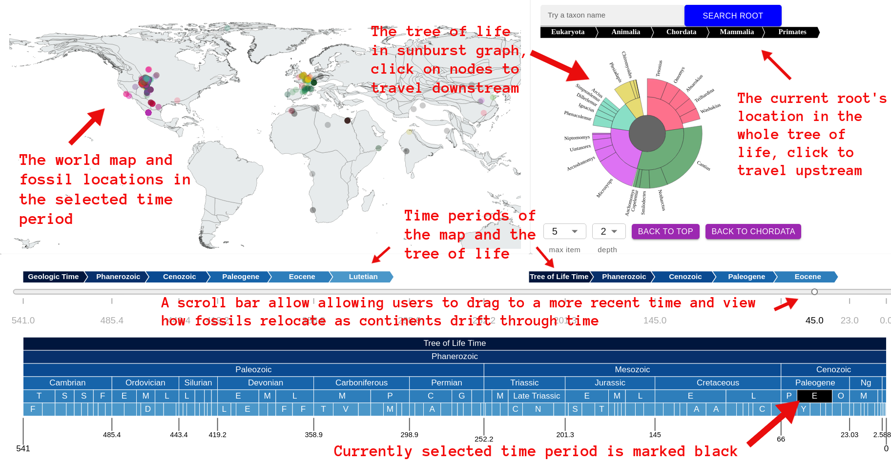

# Biodiversity visualization 

This is my master thesis project on visualizing biodiversity through time. This web application allows users to select a time period in the past 540 million years of Earth's history to view the tree of life and the fossils located on the ancient world map during the selected time period, and also track how the fossil locations shift as the continents drift along with time. The fossils are from the Paleobiology Database, which contains 1.3 million occurrences of animals and plants; the tectonic motion is modeled by this paper (https://www.sciencedirect.com/science/article/pii/S0921818116302417), which traces the coastline changes from 410 million years ago to today. The web application is yet to be finished and deployed, but some screenshots and videos showing the current progress are shown below. 

## General overview

The visualization consists of three main components.

**The tree component.** The tree of life is shown on the right-hand side as a sunburst graph. The tree is organized in the descending order of domain (Eukaryota), kingdom (Animalia or Plantae), phylum, class, order, family, genus, and species. The angles of each node reflect the number of associated fossils found during the selected time period. To navigate in the tree, users can click on 1, a node on the graph or the breadcrumbs above it, or 2, the buttons in the control panel below the tree graph. The control panel also customizes the tree's depth and each node's max number of children. 

**The map component.** On the left-hand side, the map shows how the world looked like during the selected time period, which sits beneath the map. The fossils are colored in the same way as their associated taxonomy in the tree graph, and their coordinates are also transformed to that of ancient time.

**The time control component.** At the bottom of the page we have the time control panel. A scroll bar allows users to drag to a more recent time period (but not older than the tree of life's time period, since the fossils would not have existed yet), and see how the fossils would move due to continental drift.

**Demonstration 1** We can see the sudden disappearance of the dinosaurs using this tool. In the video below, we first select the order of Avetheropoda (a.k.a. the bird dinosaurs) and locate to the time period of Early Cretaceous (approx. 145 - 100 million years ago). We then forward to Late Cretaceous and Paleocene, while seeing how the tree of life under Avetheropoda gradually changes through time. Suddenly, during Selandian (a time period under Paleogene), all but one fossil is found, and the tree completely disappears after this period. This is due to the Cretaceous–Paleogene extinction event, marked by the famous incident of an asteroid hitting the planet around 66 million years ago, ending the age of the dinosaurs. 

https://github.com/dominicdongwuxing/biodiversity-in-time/blob/main/resources/dino.webm 

**Demonstration 2** We can also look at how fossils are relocated from where they lived millions of years ago, to where they were discovered in modern days, as a result of plate motion. In the second video, we investigate the genus of Glossopteris, an iconic plant during the Permian periods. By dragging the scroll bar above the timetable, we can observe how the continents have been floating apart for the past 276 million years, and how the fossils have been moved. It is interesting to note that although the fossils are found everywhere in the modern world, they actually inhabited together when they were alive. 

https://github.com/dominicdongwuxing/biodiversity-in-time/blob/main/resources/plateMotion.webm 

**Demonstration 3** The last example looks at Hominidae, the family that hosts our species (*Homo sapien*). In the next video, users can hover on a node in the tree graph to see 1, the breadcrumb above that indicates the path from the common root to the taxonomy they are currently focusing on, and 2, the associated fossils on the map. They can also easily navigate the tree by clicking on nodes and they can customize the max children and depth to show. 

https://github.com/dominicdongwuxing/biodiversity-in-time/blob/main/resources/treeInAction.webm 

In the last video, we can see more interaction between the tree and the map. When users hover on a fossil point in the map, they can see which taxonomy it belongs to from the tree side.

https://github.com/dominicdongwuxing/biodiversity-in-time/blob/main/resources/mapInAction.webm 

Finally, [a relative link](report.pdf) contains a detailed description of how the data is processed, the design of the database (MongoDB), data queries (graphQL), and front-end (React and D3) as well as the functionalities of the web application.  