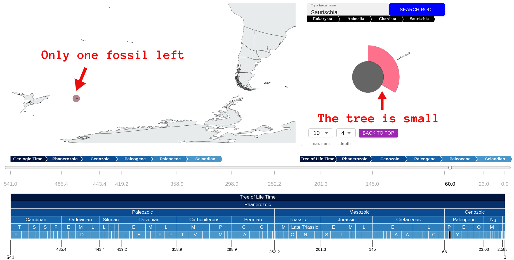

# Biodiversity visualization 

This is my master thesis project on visualizing biodiversity through time. This web application allow users to select a time period of interest through the evolutionary history to view the tree of life and the fossils located on the ancient world map during the selected time period, and also track how the fossil locations shift as the continents drift along with time. The fossils are from the PBDB database, which contains 1.3 million occurrences of animals and plants; the tectonic motion is modeled by this paper, which traces the coastline changes from 410 million years ago to today. The web application yet to be finished and deployed, but some screenshots showing the current progress are shown below. 

## General overview

The visualization consists of three main components.

**The tree component.** On the right hand side, there is the tree of life as a sunburst graph. The tree of life is organized in the following taxonomic ranks: domain (Eukaryota), kingdom (Animalia or Plantae), phylum, class, order, family, genus, species, from the highest to the lowest. The angles of each node or leaf in the tree graph reflects the amount of fossils found during the selected time period that are attached to it. The selected time period for the tree is seen right beneath the tree section, in a line of breadcrumb colored in blue. The users can click on a node to travel to a downstream tree rooted by that node. Below the tree graph are control buttons to customize 1, the max number of element to display on each level of the tree (ranked by number of fossils found in the current time period that are attached to each node) and 2, the depth to show from the current root. Also, the user can go directly back to top (the highest rank, Eukaryota domain), or somewhere lower in the upstream, whose level is also set by the depth button. Above the tree graph is a string of breadcrumbs showing the location of the current root from the ultimate root in tree of life, Eukaryota. It is possible to click on a node in the breadcrumb and travel to a new tree rooted by the clicked node. 

**The map component.** On the left hand side, the map shows how the world looked like during the selected time period, which sits beneath the map. The fossils are colored in the same way as their related taxonomy in the tree graph, and their coordinates are also transformed to that of the ancient time.

**The time control component.** At the bottom of the page we have the time control panel. A scroll bar allows users to drag to a more recent time period (but not older than the tree of life's time period, since the fossils would not have existed yet), and see how the fossil would move with the plate movment of the Earth. 

As shown in the figure above, a user can hover on a time period in the time table, and it automatically zoom in around the time period for a more detailed view, and also shows a small pop-up note indicating the name of the time period. The currently selected time period is marked black. 

**An example.** We can see the suddent disappearance of the dinasours using this tool. Dinasours belong to a variaty of classes under Chordata, one of which is the class Saurischia. We search for Saurischia by typing the name in the search bar and select the time period Danian. The map will display the world map in the middle of the time period, which is around 64 million years ago. The tree of life will be computed according to the fossil records found under Saurischia during this time period. We will get the following view:

We can see a rich tree of species existing under Saurischia during this period, and there are fossil records of Saurischia all over the world. Note that the black dots on the map corresponds to the black node on the tree, which is the root Saurischia. This means that those fossils are only identified as Saurischia, i.e., we do not know a more detailed taxonomy for them. 

We can hover on a node or leaf on the tree and see the following: 

We have hovered our mouse on T.rex. Note that the tree nodes on the ancestral path of T.rex have a slightly higher opacity, and a small pop-up also tells us the name of the node we are hovering on. In addition, above the tree graph, there is a newly generated breadcrumb showing the location of the hovered node in the whole tree of life (i.e., its path from the ultimate root, Eukaryota), this breadcrumb will change when we hover on another node, or disappear when we are not hovering on any node. On the map, we can see that all the other fossil points have disappeared, except for those that are identified to the hovered node. When we move the mouse away from the tree, all the fossil points will be back. 

Now, we move on to the next time period, Selandian, and see this:

The tree of Saurischia has only one node left, and there is also only one fossil point found in this time period. The class of Saurischia has been suddenly wiped out! This is due to the Cretaceous–Paleogene extinction event, marked by the famous incident of an asteroid hitting the planet at around 66 million years ago, ending the age of the dinasours. 